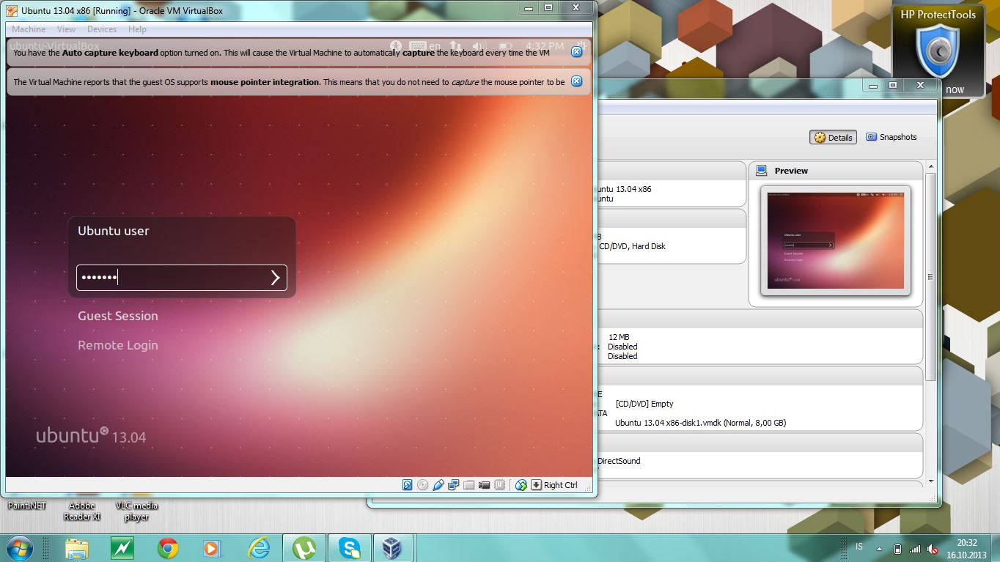

#Open Source

Sigurbjörg Jóhannesdóttir.  Vann þetta ein, er fjarnemi og búsett í Sviss.

## 1. Linux uppsetning

Að setja upp Linux var ekkert nema harmleikur.  Ég er með fartölvu, HP EliteBook 2560p, 64 bita OS og Windows 7.  Ég setti upp VirtualBox skv. leiðbeiningum og Ubuntu VirtualBox Image.
Þegar ég ræsti þetta upp þá kom fyrst villa um að USB 2.0 controller fyndist ekki þannig að ég fór í settings og tók hakið af Enable USB.  Reyndi svo aftur að ræsa upp og þá kom internal error, bara svartur skjár og ekkert gerðist meira.

## 2. Uppsetning á vim && git

Ég sá að fleiri höfðu lent í þessum vandræðum með Ubuntu VirtualBox Image og Daníel benti því fólki á að setja [Git upp á Windows] [1] þannig að ég fór þá leiðina.  Setti líka Vim upp þannig, sótti það [héðan] [2] (valdi Direct link to MS-Windows Installer).  Linux upplifunin sem ég átti að fá út úr verkefninu var alveg í mínus en uppsetningin í Windows umhverfi gekk eins og í sögu.

  [1]: http://git-scm.com/downloads/ "Git - Downloads"
  [2]: http://www.vim.org/ "welcome home: vim online"

## 3. Unnið með Git (1. hluti)

Ég gerði reyndar fork tvisvar og fór í gegnum allt ferlið, prófaði bæði með Git Bash, og fylgdi þá leiðbeiningum sem voru í verkefninu, og svo líka með GitHub for Windows Powershell sem ég setti upp [héðan] [3].  Þetta var bara tilraunastarfsemi hjá mér, langaði að sjá hvernig hvorutveggja virkaði.  Báðar leiðirnar gengu vel.  

[Forked repository] [4]  
Þar sem ég gerði þetta tvisvar þá má sjá commit-listann minn [hérna] [5]  

  [3]: http://windows.github.com/ "GitHub"
  [4]: https://github.com/boggajo/INTOPrufa/ "boggajo/INTOPrufa"
  [5]: https://github.com/boggajo/INTOPrufa/commits/ "Commits - boggajo/INTOPrufa"

## 4. Uppsettur hugbúnaður

Dæmi um Open Source forrit sem ég hef sett upp á vélinni minni:
* IntelliJ IDEA Community Edition, license Apache 2, [Source] [6] 
* Vim, license compatible with the GNU General Public License, [Source] [7] 
* 7-Zip, license GNU LGPL, [Source] [8]
  
  [6]: http://www.jetbrains.org/display/IJOS/Download/ "Download - IntelliJ Open-Source Project"
  [7]: http://www.vim.org/sources.php/ "Vim source archives"
  [8]: http://sourceforge.net/projects/sevenzip/files/ "7-Zip"

## 5. Unnið með Git (2. hluti)

Notaði Git Bash við þennan lið. Klónaði projectið yfir á mína vél, leyfði mér þann lúxus að editera md-skrána með NotePad (leiðist að nota Vim).
